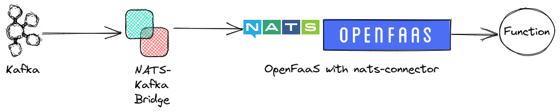

# openfaas-kafka-nats-demo
Demo of how to trigger [OpenFaas](https://www.openfaas.com/) Functions from 
[Kafka](https://kafka.apache.org/) using the kafka-nats-bridge

----
## !!! Deprecation Notice !!!
The OpenFaaS Team decided to not support nats-streaming in the now so-called Community Edition
anymore. It should not be working from June 2023. If we didn't miss a thing, from then on it is
only a Pro feature for paying customers - what a pity!

For more information on the changes in OpenFaaS check out their documentation. You can start here:
https://docs.openfaas.com/openfaas-pro/introduction/#comparison

This demo is working with the current (Sep 2022) versions of the used tools.

----

## Why? What's it all about?
OpenFaaS has no Kafka Trigger to start a function in the non-payed Version. But it is possible
to trigger a function via [NATS](https://nats.io/) Messaging.

So the purpose of this demo is to show how you can trigger functions with Kafka anyway - using 
the [NATS-Kafka Bridge](https://github.com/nats-io/nats-kafka).

The other way, sending a Kafka message from a OpenFaaS function works as well with this solution.

## Overview

- From Kafka messages supposed to trigger functions will be send
- The NATS-Kafka Bridge listens for those topics, translates them to NATS messages
  and sends them out to all subscribers
- OpenFaaS has the [nats-connector](https://github.com/openfaas/nats-connector) installed
  which subscribes to NATS Messages for functions. When such a message is received it will
  trigger all functions which are listening to this type of message.

## The setup

A step by step guide to your running setup. 
You need a running [Docker](https://www.docker.com/) environment to follow these steps.

### 1) Kafka

If you have already a running Kafka instance you can skip this step.

To install Kafka for this demo simply download current version and start the needed servers
`zookeeper` and `kafka`. You can find further instructions here: https://kafka.apache.org/quickstart

    $ cd /directory/where/you/downloaded/kafka_2.13-3.2.0/
    $ bin/zookeeper-server-start.sh config/zookeeper.properties
    $ bin/kafka-server-start.sh config/server.properties

Now Kafka is up and running.

### 2) Prepare a config for the NATS-Kafka Bridge

The [NATS-Kafka Bridge](https://github.com/nats-io/nats-kafka) is used to translate and send
messages between Kafka and NATS. For a working bridge you need to write a valid
[configuration](https://github.com/nats-io/nats-kafka/blob/main/docs/config.md).

The example we will be using is [nats-kafka.conf](nats-kafka.conf) in the root directory of
this repository.

It has a 2-way configuration:

    # NATS              KAFKA
    # ================================
    # kafka.event   --> fnevent
    # kafka.trigger <-- fntrigger

From NATS to Kafka: subject `kafka.event` is send to Kafka topic `fnevent` 
From Kafka to NATS: topic `fntrigger` is send to `kafka.trigger`

In this file you need to adjust the `servers` property to fit your NATS Server URL (see below):

    # Setup the global connection parameters to NATS
    nats: {
      #Servers: ["localhost:4222","10.60.203.14:8222"],
      Servers: ["10.60.203.14:4222"],
      ...

### 3) Start the NATS-Kafka Bridge

    $ docker run -v /absolute/path/to/nats-kafka.conf:/conf/nats-kafka.conf \
                 --network="host" natsio/nats-kafka:0.5 -c /conf/nats-kafka.conf

### 4) (optional!) Test the bridge

If you want you can now test if the bridge is working (no OpenFaaS involved).
For this we need to start a NATS server, subscribe to e.g. `kafka.trigger` (see above)
and then send a kafka message to the topic `fntrigger`. 

a) Start NATS server

    $ docker run -p 4222:4222 -ti nats:latest

(for more information about NATS server see 
https://docs.nats.io/running-a-nats-service/introduction/installation and
https://docs.nats.io/nats-concepts/core-nats/pubsub/pubsub_walkthrough)

b) Start Kafka console producer

    $ kafka-console-producer.sh --topic fntrigger --bootstrap-server localhost:9092

c) Subcribe from NATS

    $ nats sub kafka.trigger

d) Sent messages from kafka should appear now in NATS subsription

e) stop the NATS server to not block the port (4222) for OpenFaaS NATS (see following steps)

### 5) Install OpenFaaS

You can skip this step if you already have an running instance.

If you are using a Kubernetes cluster you can install OpenFaaS there - check the official
installation guide.

This demo uses faasd with multipass to omit the need of a Kubernetes cluster.
Simply follow this installation tutorial:
https://github.com/openfaas/faasd/blob/master/docs/MULTIPASS.md

Afterwards check your faasd IP address:

    $ multipass info faasd

This IP needs to be configured as server in the bridge (see step 2) above)!

### 6) Extend your OpenFaaS with nats-connector

To trigger functions via NATS you need to install the
[nats-connector](https://github.com/openfaas/nats-connector)

For this log into your faasd multipass instance and edit `/var/lib/faasd/docker-compose.yaml`

Find the config section `nats: ...`, after that section add a new one for the connector:

    ###### ADD nats-connector #####
      nats-connector:
        image: ghcr.io/openfaas/nats-connector:0.3.0
        environment:
          upstream_timeout: "1m2s"
          gateway_url: "http://gateway:8080"
          topics: "nats-test,kafka.trigger,"
          print_response: "true"
          print_body_response: "true"
          basic_auth: "true"
          secret_mount_path: "/run/secrets/"
          topic_delimiter: ","
          asynchronous_invocation: "false"
        volumes:
          # we assume cwd == /var/lib/faasd
          - type: bind
            source: ./secrets/basic-auth-user
            target: /run/secrets/basic-auth-user
          - type: bind
            source: ./secrets/basic-auth-password
            target: /run/secrets/basic-auth-password
        cap_add:
          - CAP_NET_RAW
        depends_on:
          - nats
          - gateway
    ###################################

Restart your faasd to apply the changes:

    $ systemctl daemon-reload
    $ systemctl restart faasd

